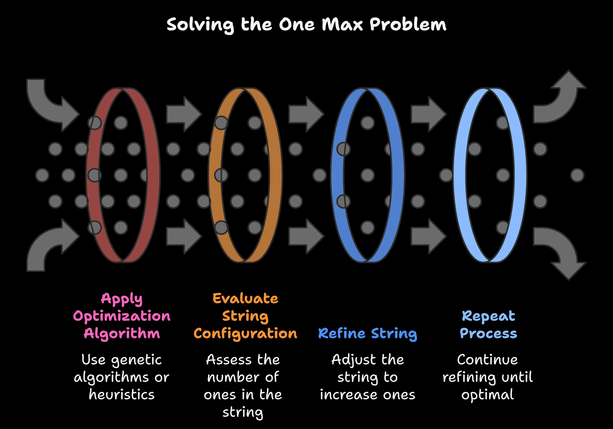

# Genetic Algorithms in Python

A compact example implementation of a genetic algorithm solving the One-Max problem (maximizing the number of 1s in a binary genome).



## What's included

- `src/main.py` — runnable example implementing initialization, selection, crossover, mutation and generation loop.
- `assets/oneMaxProblem.png` — illustration of the One-Max problem.
- `geneticAlgoVenv/` — project virtual environment (already present in repo).

## Quick start

1. (Optional) Create and activate a virtual environment, or activate the included `geneticAlgoVenv` if you prefer.

Windows (cmd):

```cmd
python -m venv .venv
.venv\Scripts\activate.bat
```

macOS / Linux:

```bash
python3 -m venv .venv
source .venv/bin/activate
```

2. Install dependencies (none required for this example, but if you add packages, use):

```bash
pip install -r requirements.txt
```

3. Run the example:

```bash
python src/main.py
```

You should see per-generation best fitness printed to the terminal.

## Notes

- Configuration constants (population size, genome length, mutation/crossover rates, generations) are at the top of `src/main.py`.
- This README is intentionally short. For experiments, tweak the constants and observe behavior.
